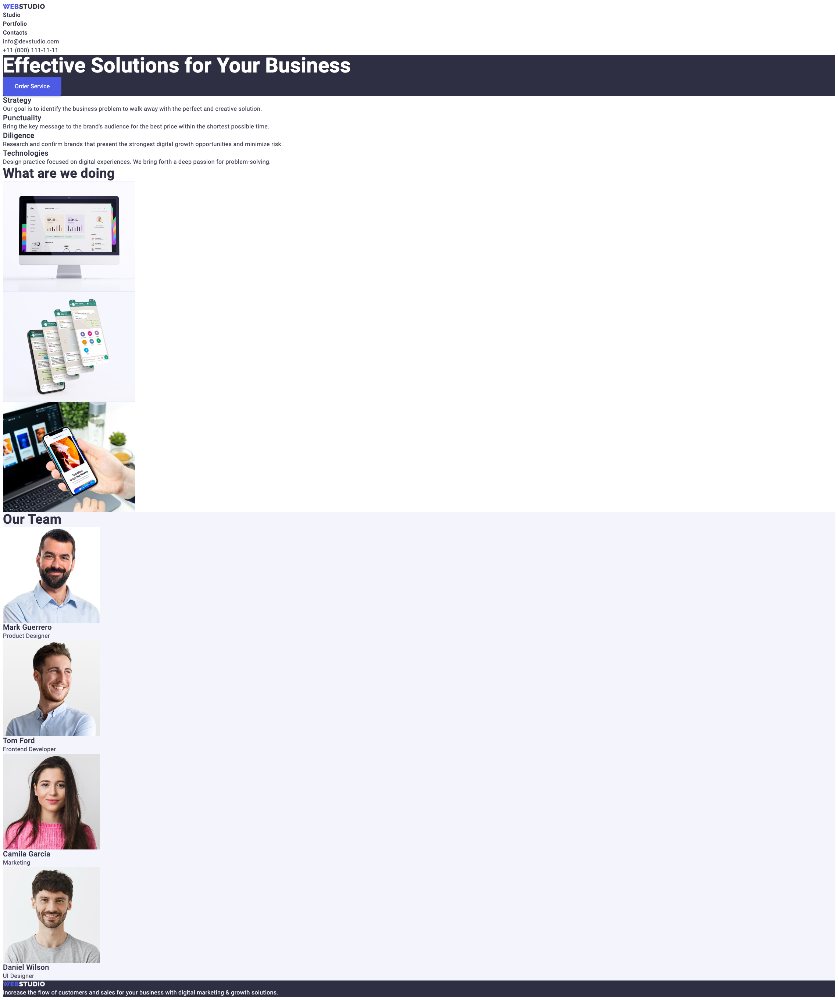

# Домашнє завдання № 2

- Створи репозиторій `goit-markup-hw-02`.
- Склонуй створений репозиторій і скопіюй в нього файли попередньої роботи.
- Виконай розмітку і оформлення макета сторінки
  [**домашнього завдання #2**](<https://www.figma.com/file/Kr5Q4EVrEAqpOWko4QeEJb/Web-Studio-(Version-4.0)?type=design&node-id=296708-626&mode=design&t=9YoxUBW347HfZFPf-0>).
- Для оптимізації зображень використовуй сервіс
  [**squoosh**](https://squoosh.app/).
- Налаштуй `GitHub Pages` і додай посилання на живу сторінку в шапку
  GitHub-репозиторія.

## Критерії приймання роботи наставником

### Проект

**`«A1»`** У корені проекту є папка `images` з зображеннями.

**`«A2»`** У корені проекту є папка `css` з файлами стилів.

**`«A3»`** Всі стилі написані в одному файлі `styles.css`, який знаходиться в
папці `css`.

**`«A4»`** У назвах файлів відсутні великі літери, пробіли і трансліт, тільки
літери і слова англійської мови.

**`«A5»`** Вихідний код відформатований за допомогою `Prettier`.

**`«A6»`** Всі зображення та текстовий контент взяті з макета.

**`«A7»`** Всі растрові зображення оптимізовані, використовуючи
[squoosh](https://squoosh.app/).

**`«A8»`** Код написаний з дотриманням [**настанови**](https://codeguide.co/).

### Розмітка

**`«B1»`** Розмітка сторінки `Портфоліо` набрана у файлі `portfolio.html`.

**`«B2»`** Виконана HTML-розмітка всіх елементів макета.

**`«B3»`** Теги використані відповідно до їх семантичного змісту.

**`«B4»`** HTML проходить перевірку
[**валідатором**](http://validator.w3.org/nu/) без помилок.

**`«B5»`** Імена класів описові та зрозумілі іншому розробнику.

**`«B6»`** Імена класів не містять великих літер, пробілів, трансліту і назв
тегів, тільки літери і слова англійської мови. Якщо ім'я класу складається з
декількох слів, вони розділяються дефісом.

**`«B7»`** Атрибут `href` навігаційних посилань `Студія` і `Портфоліо` містить
відносний шлях до HTML-файлів цих сторінок. Під час натискання на посилання
відбувається перехід на відповідну сторінку у поточній вкладці браузера.

**`«B8»`** У тегів `` вказані атрибути розмірів, як мінімум `width`.

**`«B9»`** Зображення експортовані з макета у форматі `jpg`.

**`«B10»`** Групи однотипних елементів зібрані у списки `<ul>`.

**`«B11»`** Фільтр на сторінці `Портфоліо` виконаний списком кнопок, кожній з
яких заданий атрибут `type="button"`.

**`«B12»`** Розмітка хедера і футера однакова на всіх сторінках.

**`«B13»`** Всі необхідні шрифти за макетом та їх варіації (вага і накреслення)
підключені з сервісу Google Fonts одним посиланням. Необхідна вагу для `Raleway`
– 700, а для `Roboto` – 400, 500, 700 і 900.

**`«B14»`** Всередині розмітки кнопок відсутні додаткові елементи, наприклад
спани або посилання.

## Оформлення

**`«C1»`** Для оформлення використовуються селектори класу.

**`«C2»`** В стилях відсутній `!important`.

**`«C3»`** Інтерактивні елементи (кнопки і посилання), при наведенні мишкою або
фокусі з клавіатури, мають активний стан, вказаний в
[**Style guide**](<https://www.figma.com/file/B1m2uk25m1eAgroESAuM2g/Web-Studio-(Version-3.0)?type=design&node-id=296641-536&mode=design&t=aZfaXw4g37J9uDEh-0>)
(зміна кольору).

**`«С4»`** Текст контактів в хедері змінює колір при ховері і фокусі.

**`«C5»`** Для зберігання палітри кольорів макета (текст, фон, виділення)
використовуються CSS-змінні.

**`«С6»`** Для елемента `<body>` задана властивість `font-family` з домінантним
шрифтом на макеті `Roboto`.

**`«С7»`** Вказати тип сімейства (без зарубок) в кінці переліку `font-family` в
елемента `<body>`.

**`«С8»`** Сімейство шрифтів `Roboto` явно задане тільки для елемента `<body>`,
інші елементи наслідують його.

**`«С9»`** Для елемента `<body>` задана властивість `color` з кольором тексту,
домінантним на макеті. Решта тексту наслідує або перекриває це значення.

**`«С10»`** Розмір шрифту (властивість `font-size`) всіх текстових елементів
точно відповідає значенням з макета.

**`«С11»`** Висота рядка (властивість `line-height`) всіх текстових елементів
точно відповідає значенням з макета і задана як множник, а не в `px`.

**`«С12»`** Колір (властивість `color` та `background-color`) всіх текстових
елементів точно відповідає значенням з макета.

**`«С13»`** Вага шрифту (властивість `font-weight`) всіх текстових елементів
точно відповідає значенням з макета.

**`«С14»`** Вага шрифту (властивість `font-weight`) явно вказана тільки, якщо
значення в макеті відрізняється від стандартного для цього елемента в браузері.

**`«С15»`** Кнопкам задана властивість `cursor` зі значенням `pointer`.

**`«С16»`** У стилях не повторюються значення властивостей, які задані браузером
за замовчуванням. Наприклад, посиланням не потрібно вказувати `cursor: pointer`,
а абзацам `font-style: normal` або `font-weight: 400`.

# Web Studio

---

